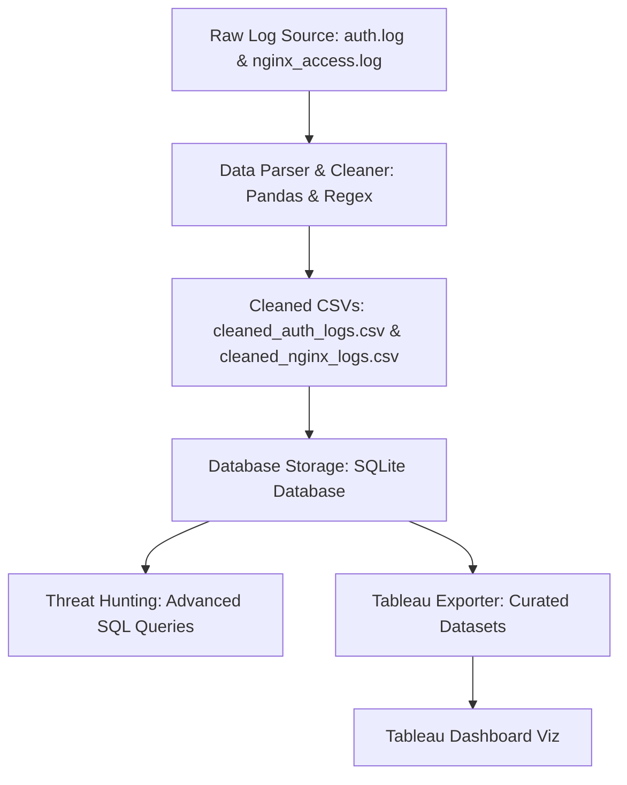

# Custom SIEM Log Analysis & Threat Hunting Pipeline

A python and SQL-based Security Information and Event Management (SIEM) data pipeline designed to parse system authentication logs (`auth.log`) and Nginx web server access logs (`nginx_access.log`), ingest them into an indexed SQLite database, run threat-hunting queries to detect anomalies, and export clean aggregated data for Tableau dashboards.

This project is a practical demonstration of **Security Data Engineering** and **Threat Hunting** methodologies.

---

## 🏗️ Pipeline Architecture

The pipeline processes data through five core phases:



1. **Log Generation**: Synthetic logs are generated modeling realistic web traffic and authentication events containing baseline system activity mixed with targeted attacks (SSH brute force and Directory Traversal).
2. **ETL (Extract, Transform, Load)**: A regex-based parser extracts fields (Timestamp, Source IP, HTTP Status/Action, Target URL/User) from raw unstructured text files and standardizes data types.
3. **Database Storage**: The cleaned logs are loaded into an indexed SQLite database (`siem_pipeline.db`).
4. **Threat Hunting**: Analytical SQL queries correlate system anomalies and detect credential compromises or path traversals.
5. **Visualization**: Aggregated CSVs are exported to feed interactive Tableau security dashboards.

---

## 📁 Repository Structure

* `generate_logs.py` — Simulates and builds the raw log files with security anomalies.
* `parse_logs.py` — Extracts and sanitizes fields using regular expressions and Pandas.
* `store_logs.py` — Connects to SQLite, sets up the table schemas, adds indexing, and loads data.
* `hunt_threats.py` — Runs the threat hunting SQL queries against the local database.
* `export_for_tableau.py` — Exports curated CSV files optimized for Tableau dashboard widgets.
* `test_parser.py` — Python unit testing suite verifying the regex parser functions.

---

## 🚀 Getting Started

### Prerequisites
You only need Python 3 and Pandas installed.

```bash
pip install pandas
```

### Running the Pipeline
Run the scripts in sequence to build and verify the pipeline:

```bash
# 1. Generate the synthetic raw logs
python generate_logs.py

# 2. Run unit tests to verify the log parsing logic
python test_parser.py

# 3. Parse and clean raw logs into CSVs
python parse_logs.py

# 4. Ingest parsed logs into the indexed SQLite database
python store_logs.py

# 5. Run threat hunting SQL queries to check for anomalies
python hunt_threats.py

# 6. Export datasets for Tableau
python export_for_tableau.py
```

---

## 🎯 Threat Detections Included

### 1. SSH Brute Force Detection
Groups and alerts on external IP addresses with high frequency of failed logins:
```sql
SELECT source_ip, COUNT(*) as failed_attempts, MIN(timestamp) as attack_start, MAX(timestamp) as attack_end
FROM auth_logs
WHERE action = 'Failed Login'
GROUP BY source_ip
HAVING failed_attempts > 5;
```

### 2. Compromise Correlation (Failed Logins ➔ Success)
Tracks if a brute-forcing IP successfully logged in afterward, identifying compromised user accounts (High Severity / P1 incident):
```sql
WITH failures AS (
    SELECT source_ip, COUNT(*) as failed_count, MIN(timestamp) as first_fail
    FROM auth_logs
    WHERE action = 'Failed Login'
    GROUP BY source_ip
    HAVING failed_count > 5
),
successes AS (
    SELECT source_ip, timestamp as success_time, target_user
    FROM auth_logs
    WHERE action = 'Successful Login'
)
SELECT f.source_ip, f.failed_count, f.first_fail, s.success_time, s.target_user
FROM failures f
JOIN successes s ON f.source_ip = s.source_ip
WHERE s.success_time >= f.first_fail;
```

### 3. Directory Traversal Attacks
Detects web scanning attempts attempting path traversal sequences (like `..` or `/etc/passwd`):
```sql
SELECT ip, timestamp, method, url, status, bytes
FROM web_logs
WHERE url LIKE '%..%' OR url LIKE '%/etc/%' OR url LIKE '%/win.ini%' OR url LIKE '%boot.ini%';
```

---

## 📊 Tableau Dashboard Integration

Import the following exported files from the `/boii` directory into Tableau:
1. `tableau_traffic_timeline.csv` — Map hourly traffic and errors to a dual-axis line chart to highlight scanning spikes.
2. `tableau_ssh_attacks.csv` — Create a vertical bar chart of failed authentications grouped by IP to isolate attackers.
3. `tableau_web_attacks.csv` — Feed a raw detail grid highlighting anomalous target directories (like `/etc/passwd`).

*For an advanced portfolio project, use a GeoIP Python package (like `geoip2`) during the cleaning phase to resolve public attacker IPs into country/city coordinates and build an interactive Attack World Map in Tableau.*
