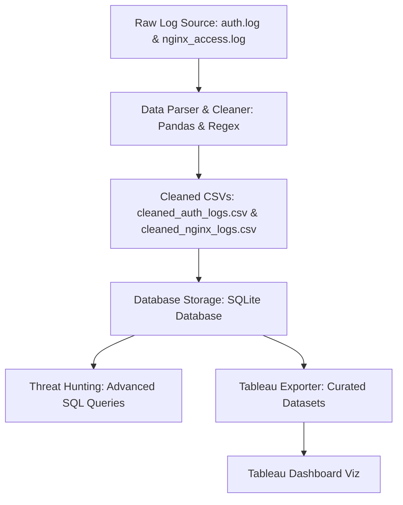

# Custom SIEM Log Analysis & Threat Hunting Pipeline

A python and SQL-based Security Information and Event Management (SIEM) data pipeline designed to parse system authentication logs (`auth.log`) and Nginx web server access logs (`nginx_access.log`), ingest them into an indexed SQLite database, run threat-hunting queries to detect anomalies, and export clean aggregated data for Tableau dashboards.

Additionally, this tool includes an **Interactive Live Security Auditor** that scans your own machine's active logs and filters out false positives using an employee whitelist.

---

## 🏗️ Pipeline Architecture

The pipeline processes data through five core phases:



1. **Log Generation**: Synthetic logs are generated modeling realistic web traffic and authentication events containing baseline system activity mixed with targeted attacks (SSH brute force and Directory Traversal).
2. **ETL (Extract, Transform, Load)**: A regex-based parser extracts fields (Timestamp, Source IP, HTTP Status/Action, Target URL/User) from raw unstructured text files and standardizes data types.
3. **Database Storage**: The cleaned logs are loaded into an indexed SQLite database (`siem_pipeline.db`).
4. **Threat Hunting**: Analytical SQL queries correlate system anomalies and detect credential compromises or path traversals.
5. **Visualization**: Aggregated CSVs are exported to feed interactive Tableau security dashboards.

---

## 📁 Repository Structure

* `run.py` — The unified command-line entry point and SET-style interactive TUI.
* `generate_logs.py` — Simulates and builds the raw log files with security anomalies.
* `parse_logs.py` — Extracts and sanitizes fields using regular expressions and Pandas.
* `store_logs.py` — Connects to SQLite, sets up the table schemas, adds indexing, and loads data.
* `hunt_threats.py` — Runs the threat hunting SQL queries against the local database.
* `export_for_tableau.py` — Exports CSV datasets optimized for Tableau dashboard widgets.
* `live_audit.py` — Evaluates local system logs and correlates them with the employee whitelist.
* `employee_directory.csv` — Whitelist containing usernames, names, and approved IPs.
* `test_parser.py` — Python unit testing suite verifying the regex parser functions.

---

## ⚙️ Operation Guide

This tool supports two modes of operation: **Interactive Menu Mode** (for manual use) and **Scripted CLI Mode** (for automated scheduling/cron jobs).

### Mode A: Interactive Menu (SET-Style TUI)
If you run the runner script **without any arguments**, it launches a terminal-based menu featuring a retro ASCII art banner:

```bash
python run.py
```

#### Menu Options Map:
* **Option 1 (Generate Logs)**: Triggers the log generator to build new sandbox logs (`auth.log` and `nginx_access.log`).
* **Option 2 (Run Tests)**: Runs the testing framework `test_parser.py` to confirm the regex parsers match standard syslog configurations.
* **Option 3 (Parse Logs)**: Invokes Pandas cleaning and formats the log data to intermediate CSVs.
* **Option 4 (Ingest Database)**: Writes data to SQLite, setting up indices (`idx_web_ip`, `idx_auth_ip`, etc.) for optimized querying.
* **Option 5 (Execute Queries)**: Runs the threat hunting script to display detections in your terminal.
* **Option 6 (Export for Tableau)**: Extracts tailored views into flat files ready for Tableau import.
* **Option 7 (Interactive Live System Audit)**: Prompts you to scan your actual OS logs (Linux / macOS / custom path) and filter by specific IPs.
* **Option 8 (Run Complete Pipeline)**: Executes all stages (1 through 6) in sequence.
* **Option 9 (View Whitelist)**: Prints out the contents of the `employee_directory.csv` file.

---

### Mode B: Scripted CLI Mode (For Automation)
If you provide command-line arguments, the TUI is bypassed, and the script runs quietly. This is ideal for Cron scheduling or CI/CD testing:

```bash
# Display help information, flags, and usage syntax
python run.py --help

# Run the complete pipeline end-to-end silently
python run.py --all

# Run ONLY the threat queries and database storage
python run.py --store --hunt

# Launch the live system auditor directly
python run.py --live
```

---

## 🛡️ Whitelist & False Positive Filtering

When running the **Live System Audit** (`python run.py --live`), the tool uses **[employee_directory.csv](file:///d:/boii/employee_directory.csv)** to enrich the logs and classify actions:

* **Low Risk**: If a failed login attempt occurs on a username matching the whitelist, coming from that employee's `approved_ip`, it is flagged as `LOW RISK - EMPLOYEE FAT-FINGER TYPO` (filtering out human error).
* **Critical Mismatch**: If a successful login occurs on a whitelisted employee from an **unapproved IP**, it triggers `ALERT! (IP MISMATCH)`.
* **High Risk**: Failed logins targeting admin accounts (`root`, `admin`) from unknown external IPs trigger a `HIGH RISK - BRUTE FORCE DETECTED` alert.

> [!WARNING]
> **Permission Privileges**: Because system logs are protected, you must run the live auditor with administrator or root privileges:
> ```bash
> sudo python run.py --live
> ```

---

## 📊 Tableau Dashboard Integration

Import the following exported files into Tableau:
1. `tableau_traffic_timeline.csv` — Map hourly traffic and errors to a dual-axis line chart to highlight scanning spikes.
2. `tableau_ssh_attacks.csv` — Create a vertical bar chart of failed authentications grouped by IP to isolate attackers.
3. `tableau_web_attacks.csv` — Feed a raw detail grid highlighting anomalous target directories (like `/etc/passwd`).
