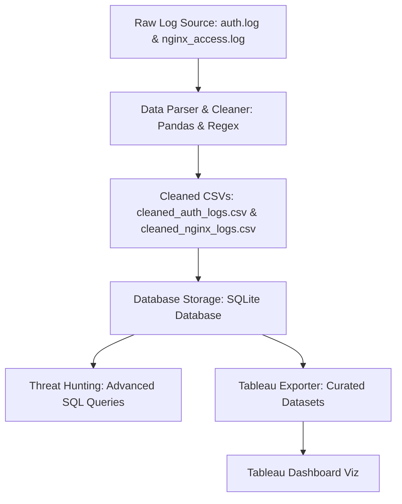

# Custom SIEM Log Analysis & Threat Hunting Pipeline

A python and SQL-based Security Information and Event Management (SIEM) data pipeline designed to parse system authentication logs (`auth.log`) and Nginx web server access logs (`nginx_access.log`), ingest them into an indexed SQLite database, run threat-hunting queries to detect anomalies, and export clean aggregated data for Tableau dashboards.

Additionally, this tool includes an **Interactive Live Security Auditor** that scans your own machine's active logs and filters out false positives using an employee whitelist.

---

## 🏗️ Pipeline Architecture

The pipeline processes data through five core phases:



1. **Log Generation**: Synthetic logs are generated modeling realistic web traffic and authentication events containing baseline system activity mixed with targeted attacks (SSH brute force and Directory Traversal).
2. **ETL (Extract, Transform, Load)**: A regex-based parser extracts fields (Timestamp, Source IP, HTTP Status/Action, Target URL/User) from raw unstructured text files and standardizes data types.
3. **Database Storage**: The cleaned logs are loaded into an indexed SQLite database (`siem_pipeline.db`).
4. **Threat Hunting**: Analytical SQL queries correlate system anomalies and detect credential compromises or path traversals.
5. **Visualization**: Aggregated CSVs are exported to feed interactive Tableau security dashboards.

---

## 📁 Repository Structure

* `run.py` — The unified command-line entry point and SET-style interactive TUI.
* `generate_logs.py` — Simulates and builds the raw log files with security anomalies.
* `parse_logs.py` — Extracts and sanitizes fields using regular expressions and Pandas.
* `store_logs.py` — Connects to SQLite, sets up the table schemas, adds indexing, and loads data.
* `hunt_threats.py` — Runs the threat hunting SQL queries against the local database.
* `export_for_tableau.py` — Exports CSV datasets optimized for Tableau dashboard widgets.
* `live_audit.py` — Evaluates local system logs and correlates them with the employee whitelist.
* `employee_directory.csv` — Whitelist containing usernames, names, and approved IPs.
* `test_parser.py` — Python unit testing suite verifying the regex parser functions.

---

## ⚙️ Installation & Setup

If you have cloned this repository from GitHub, follow these steps to run the pipeline on your machine:

### 1. Clone the Repository
Clone the repository to your local computer and navigate to the directory:
```bash
git clone https://github.com/SohamaSaha408/siem-log-analysis-pipeline.git
cd siem-log-analysis-pipeline
```

### 2. Set Up a Virtual Environment (Optional but Recommended)
Creating a virtual environment isolates the project dependencies:
```bash
# On Linux / macOS:
python3 -m venv venv
source venv/bin/activate

# On Windows (Command Prompt):
python -m venv venv
venv\Scripts\activate.bat

# On Windows (PowerShell):
python -m venv venv
venv\Scripts\Activate.ps1
```

### 3. Install Dependencies
Install the required libraries (Pandas) specified in `requirements.txt`:
```bash
pip install -r requirements.txt
```

---

## 🚀 How to Run the Tool

The repository uses a unified runner script **`run.py`**. You can run it in two modes:

### Mode A: Interactive TUI Menu (For Manual Auditing)
To launch the Social Engineering Toolkit (SET)-style interactive TUI menu, simply run the script without any arguments:
```bash
python run.py
```
This loads a text menu where you can run individual pipeline stages, run the unit tests, view whitelists, or execute the live system security audit.

### Mode B: Automated Script Mode (For Cron / Automated tasks)
To automate the pipeline or run specific stages without menus, pass the appropriate command-line flags:
```bash
# Run the entire pipeline silently end-to-end
python run.py --all

# Run only the log generator and parser phases
python run.py --generate --parse

# Run threat hunting queries against the SQLite database
python run.py --hunt

# Launch the live system auditor directly
python run.py --live
```

---

## 🛡️ Whitelist & False Positive Filtering

When running the **Live System Audit** (`python run.py --live` or **Option 7** in the menu), the tool uses **[employee_directory.csv](file:///d:/boii/employee_directory.csv)** to enrich system logs and classify actions:

* **Low Risk**: Failed logins on whitelisted accounts originating from their approved employee IP are flagged as `LOW RISK - EMPLOYEE FAT-FINGER TYPO` (preventing false alerts).
* **Critical Mismatch**: Successful logins on employee accounts originating from an unapproved IP trigger a critical `ALERT! (IP MISMATCH)` warning.
* **High Risk**: Failed logins targeting administrative accounts (`root`, `admin`) from unknown external IPs trigger `HIGH RISK - BRUTE FORCE DETECTED`.

> [!WARNING]
> **Permission Privileges**: Because system logs are protected, you must run the live auditor with administrator or root privileges:
> ```bash
> sudo python run.py --live
> ```

---

## 📊 Tableau Dashboard Integration

Import the following exported files from the `/boii` directory into Tableau:
1. `tableau_traffic_timeline.csv` — Map hourly traffic and errors to a dual-axis line chart to highlight scanning spikes.
2. `tableau_ssh_attacks.csv` — Create a vertical bar chart of failed authentications grouped by IP to isolate attackers.
3. `tableau_web_attacks.csv` — Feed a raw detail grid highlighting anomalous target directories (like `/etc/passwd`).
